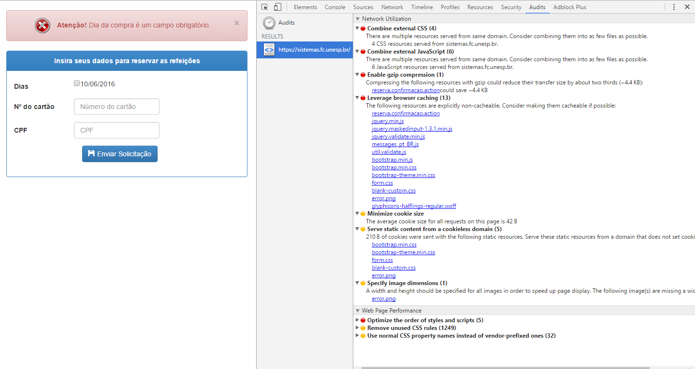

Hora do **RU**
====

Com a contribuição de **vários alunos** do DCo *(Departamento de Computação)* da
FC *(Faculdade de Ciências)* dentro da UNESP campus Bauru *(que é foda)*
construimos este pequeno
[script](sistemas.fc.unesp.br-ru-reserva.confirmacao.action.sh) para resevar
nosso querido burocrático RU *(Restaurante Universitário)* de toda semana.

# Motivação

Toda semana na segunda-feira as 7:30 da manhã as *(miseras)* 300 reservas
diárias de refeições do RU para a semana seguinte são disponibilizadas para
*(quase)* todos alunos *(com boa conexão à internet, tempo, paciência e força de
vontade)*.

Os alunos, munidos de seu CPF e Carteirinha de RU acessam o [site de reserva
*(cheio de nonsene)*] que tem bordas inúteis e uma peça central (iframe) que faz
a reserva mas na verdade é um [site de reserva simples] (menos nonsene, mas
continua com bibliotecas exageradas, erros de UX e Web).

Após a reserva pode-se verificar o saldo devedor no [site de consulta *(cheio de
nonsene)*] ou no [site de consulta simples]. Este saldo deve ser pago na AG até
o penultimo dia útil da mesma semana.

Devido ao alta concorrência dos quase 6 000 usuários do campus *(nem todos
utilizam o RU, estimamos que sejam menos de 500 mas nenhuma estatística do RU
foi encontrada no site deles)* sobre as 300 refeições de cada dia é muito comum
requisições ao servidor demorarem minutos ao invés dos já longos 400ms *(tive
experiências de requisições de 8 minutos)* achamos necessário uma abordagem mais
confiável do que nossos navegadores carregados de bibliotecas que atrapalham a
UX.

Além disso, propomos um aplicativo mais coeso construido a partir deste software
para que um navegador ou aplicativo móvel possa ser utilizado.

[site de reserva *(cheio de nonsene)*]:(http://www.bauru.unesp.br/#!/restaurante-universitario---ru/reserva-de-refeicoes/)

[site de consulta *(cheio de nonsene)*]:(http://www.bauru.unesp.br/#!/restaurante-universitario---ru/consulta-de-reservas-pendentes/)

[site de reserva simples]:(https://sistemas.fc.unesp.br/ru/reserva.confirmacao.action)

[site de consulta simples]:(https://sistemas.fc.unesp.br/ru/reserva.pesquisar.action)


# Como usar

Este script foi pensado para o ambiente [GNU BASH](https://www.gnu.org/software/bash/).

## Altere o script

Adicione os seus dados:
```
# USAGE GUIDE
reserva_ru "9999" "999.999.999-99" &
pesquisa_ru "9999" &
```

## Execute

Em um ambiente BASH faça:
```
$ ./sistemas.fc.unesp.br-ru-reserva.confirmacao.action.sh > reserva-seman.out
```

## (Opcional) Apenas alguns dias

Altere a função trocando as atribuições de dias por vazio:
```
reserva_ru() {
	# SEGUNDA="txt_dias=06"%"2F06"%"2F2016&"
	SEGUNDA=""
```


# Lista de Abreviaturas e definições

|Palavra chave	| Definição |
|---------------|-----------|
| DCo			| Departamento de Computação - Não relacionado a este software, apenas um lugar comum onde quem faz software e usa o RU frequenta.(https://www.fc.unesp.br/#!/departamentos/computacao/) |
| FC			| Faculdade de Ciências - Engloba o DCo (tem a mesma relação com os alunos) e hospeda (possivelmente criador) o sistema online do RU. (https://www.fc.unesp.br/)|
| UNESP			| Universidade Estadual Paulista "Júlio de Mesquita Filho". (https://www.unesp.br/)|
| Campus de Bauru | Área da UNESP em Bauru, contém 4 unidades: Faculdade de Ciências ([FC](http://www.fc.unesp.br/)), Faculdade de Engenharia ([FEB](http://www.feb.unesp.br/)), Faculdade de Arquitetura, Artes e Comunicação ([FAAC](http://www.faac.unesp.br/)) e Administração Geral ([AG](http://www.bauru.unesp.br/)). *(Eu sei, é uma descrição muito longa e burocrática para algo que é simplesmente conhecido como `UNESP Bauru`, pra mim deveria ser uma coisa só, menos burocratico e mais barato)*. *(Also `bauru é foda`)*. |
| RU 			| Restaurante Universitário na UNESP campus de Bauru -  (http://www.bauru.unesp.br/#!/restaurante-universitario---ru/) |
| (nonsene)		| Qualquer software caracterisado por: Atingir seus requisitos mínimos *apenas*; Dificil de utilizar; Dificil de expandir; |


# Lista de nonsense (erros, falhas, enganos e equivocos)

| nome 						| caracteristica 				| solução proposta		| correção	|
|---------------------------|-------------------------------|-----------------------|-----------|
|~~Reserva antes do horario~~| atraves do [site de reserva simples] podia-se reservar antes das 7:30	| O site continha 3 páginas (solicitacao.action - entrada de texto do CPF, numero RU e caixas de checagem com os dias -, confirmacao.action - mesmos dados porém não editaveis - e a ultima pagina informando a conclusao da reserva) para acessar um único recurso, apenas a primeira era validade. Proposta era deixar apenas uma pagina para o recurso e utilizar diferentes métodos HTTP para cada operação. | Corrigido |
| Recursos inutilizados | São listados como recursos mas não existem | Remover a listagem no html. |  |
| Validação de campo 	| Apesar da trivialidade da página é utilizada validação no lado do cliente dificultando a utlização de recursos do navegador como auto preenchimento (que é interessante para este tipo de página) | Este tipo de validação está disponível como [padrão web](https://www.w3.org/TR/html5/forms.html#the-pattern-attribute) e é acessível sem bibliotecas complexas que atrapalham a UX [na maioria dos navegadores](http://caniuse.com/#feat=input-pattern). Validação no lado do servidor com tolerância a falta de formato das entradas |  |
| Falta de Labels | Falha na UX, toda interação na escolha das datas nada tem a ver com a data, mas com uma caixa de seleção difícil de acertar. | Colocar as labels ou mudar o metodo de escolha de data. | |
| Falta de uma API | Para aplicações modernas poucos são os casos de uma renderização com dados no servidor por ser um processo muit lento (mínimo de 400ms neste caso) | Disponibilizar uma API para a troca dos dados e entidades | |



No geral, sabemos que este não é o framework mais moderno e adequado para este
tipo de carga pois ele é voltado para uma grande aplicação horizontal (muitas
funcionalidades, poucos usuários) e nossas opiniões são modeladas de maneira
muito contrastante com a realidade da UNESP.
